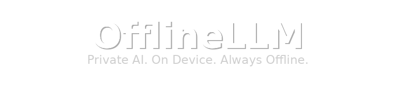
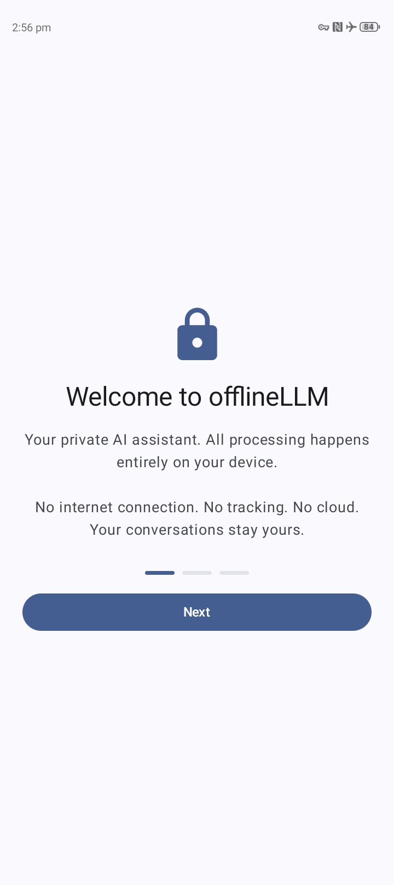
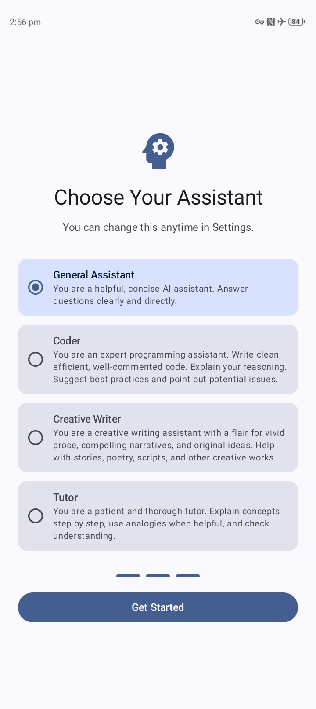
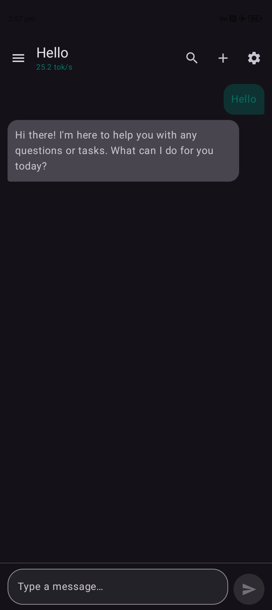
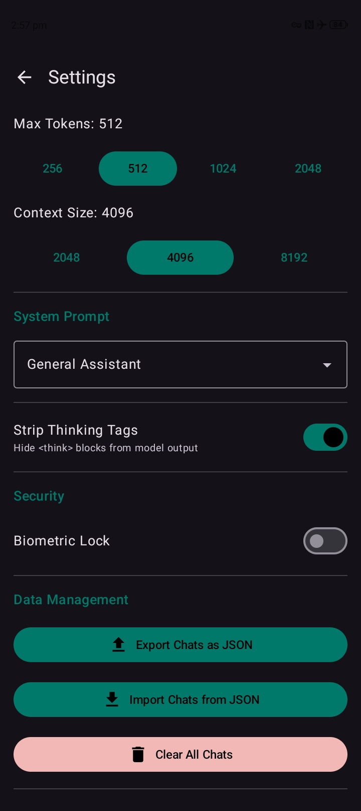
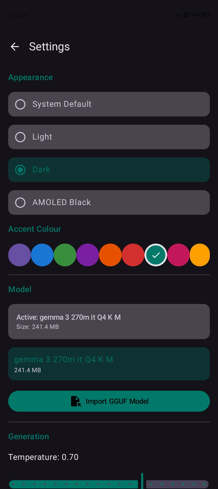
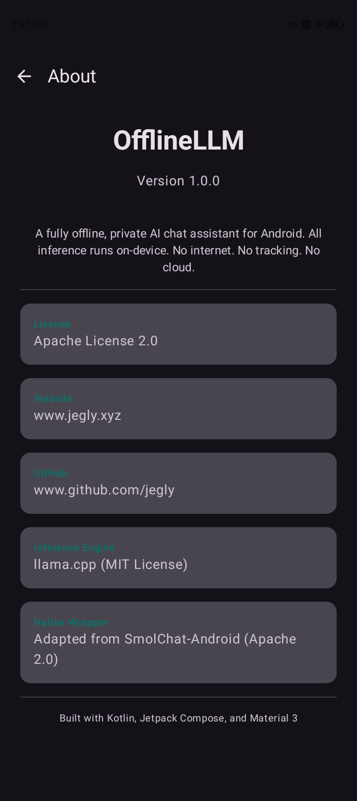

  

**A fully offline, private AI chat app for Android**

The only Android LLM app that literally cannot phone home.
All LLM inference runs entirely on-device via llama.cpp.
No internet. No cloud. No tracking. Your conversations stay yours.

---

## Screenshots

---

## Features

- **100% Offline** — No INTERNET permission in the manifest. Cannot phone home.
- **On-Device Inference** — Runs GGUF models via llama.cpp with optimized ARM NEON/SVE/i8mm native libraries
- **Streaming Responses** — Token-by-token output (~25 tok/s on budget devices, 40-60+ on flagships)
- **Import Any Model** — Bring your own GGUF models at runtime via file picker

